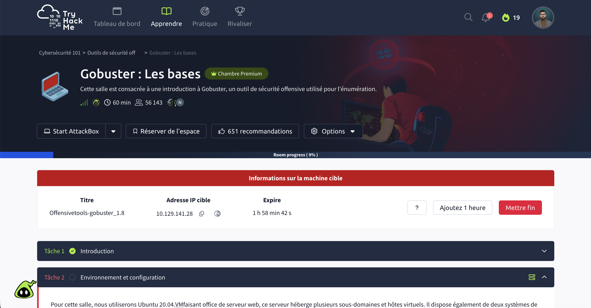
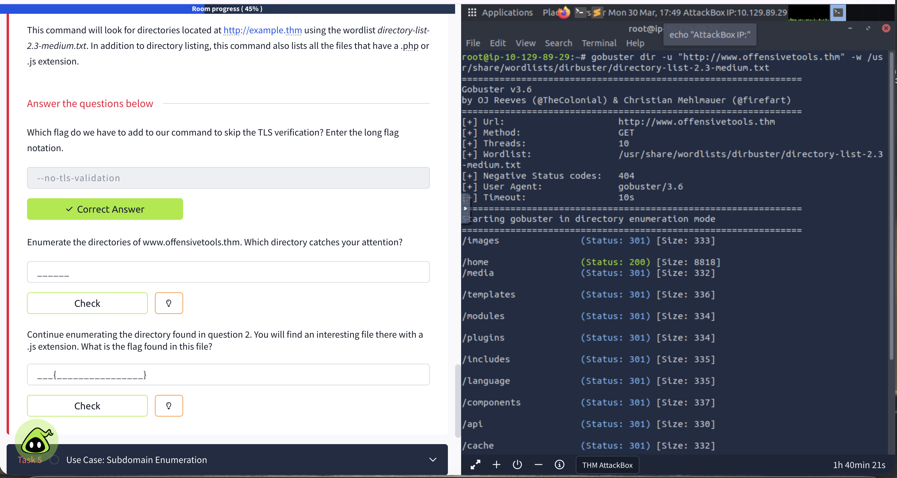
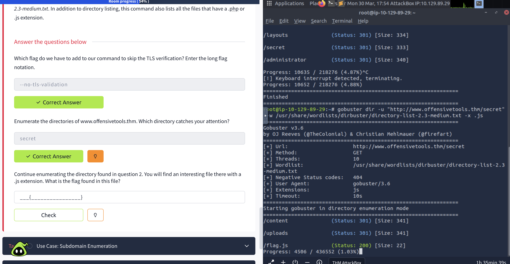
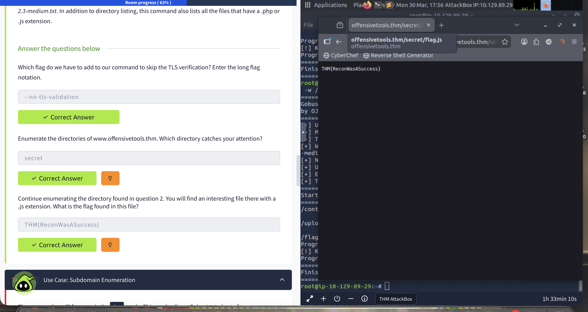
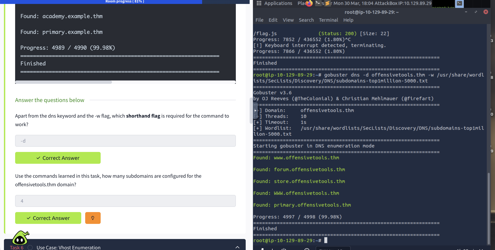
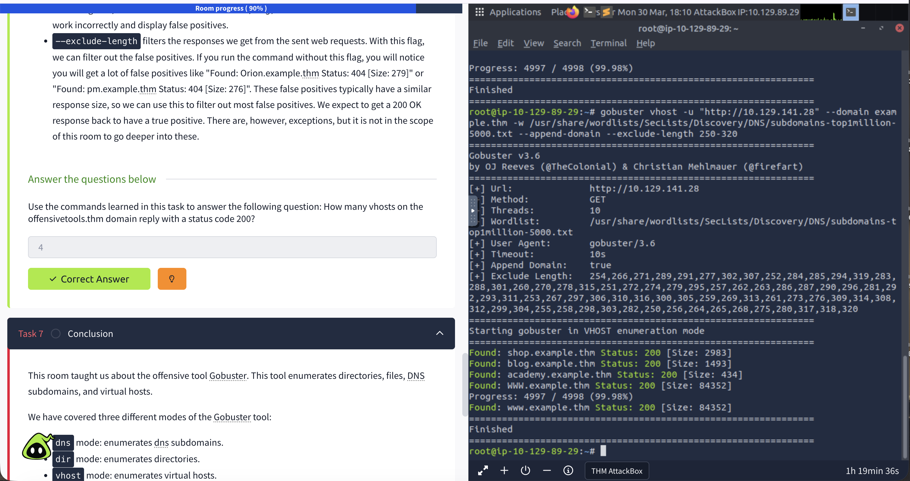
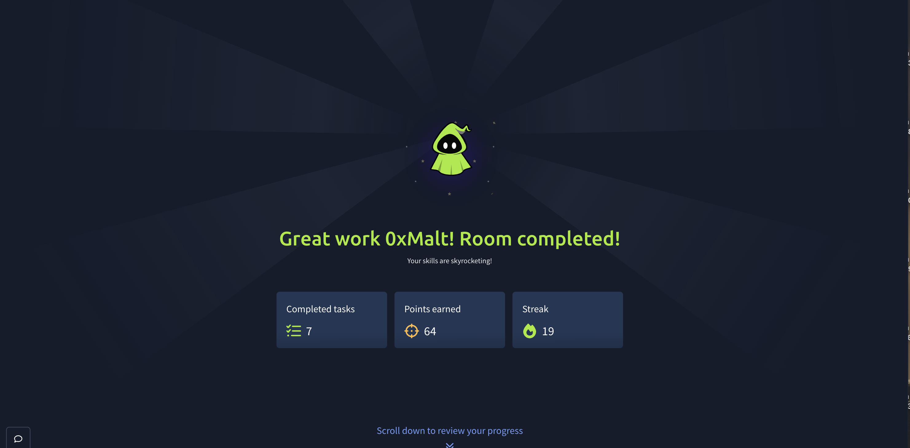

# Gobuster: The Basics - TryHackMe

**Difficulty:** Easy
**OS:** Linux
**Date:** March 30, 2026
**Time:** ~1h30
**Room link:** https://tryhackme.com/room/gobusteruf

---

## 🎯 Objective

Introduction to Gobuster, an offensive enumeration tool for discovering web directories, files, DNS subdomains and virtual hosts.

---

## 📚 Introduction

Gobuster is an open-source tool written in Go used for enumerating:
- Web directories and files (`dir` mode)
- DNS subdomains (`dns` mode)
- Virtual hosts (`vhost` mode)
- Amazon S3 buckets



---

## 💥 Task 4 - Directory & File Enumeration

### Question 1: Flag to skip TLS verification?

**Answer:** `--no-tls-validation`

### Directory Enumeration

```bash
gobuster dir -u "http://www.offensivetools.thm" -w /usr/share/wordlists/dirbuster/directory-list-2.3-medium.txt
```

**Discovered:**
- `/images` (Status: 301)
- `/home` (Status: 200)
- `/media` (Status: 301)
- `/secret` (Status: 301) ← Suspicious directory



### Question 2: Which directory catches your attention?

**Answer:** `secret`

### Enumeration with .js extension

```bash
gobuster dir -u "http://www.offensivetools.thm/secret" -w /usr/share/wordlists/dirbuster/directory-list-2.3-medium.txt -x .js
```

**Discovered:**
- `/flag.js` (Status: 200)



### Question 3: Flag found in the .js file?

Navigating to `http://www.offensivetools.thm/secret/flag.js`



**Flag:** `THM{ReconWasASuccess}`

---

## 🌐 Task 5 - DNS Subdomain Enumeration

### Question 1: Required shorthand flag?

**Answer:** `-d`

### Subdomain Enumeration

```bash
gobuster dns -d offensivetools.thm -w /usr/share/wordlists/SecLists/Discovery/DNS/subdomains-top1million-5000.txt
```

**Results:**
- `www.offensivetools.thm`
- `forum.offensivetools.thm`
- `store.offensivetools.thm`
- `primary.offensivetools.thm`



### Question 2: Number of subdomains?

**Answer:** `4`

---

## 🖥️ Task 6 - Virtual Host Enumeration

### Vhost Enumeration

```bash
gobuster vhost -u "http://10.129.141.28" --domain example.thm -w /usr/share/wordlists/SecLists/Discovery/DNS/subdomains-top1million-5000.txt --append-domain --exclude-length 250-320
```

**Results (Status 200):**
- `shop.example.thm`
- `blog.example.thm`
- `academy.example.thm`
- `WWW.example.thm`



### Question 1: Number of vhosts responding with 200?

**Answer:** `4`

---

## 📚 What I Learned

1. **Gobuster has 3 main modes**: `dir`, `dns`, `vhost` for different enumeration types

2. **Extensions are crucial**: The `-x` flag uncovers hidden files (.js, .php, .txt, etc.)

3. **Adapted wordlists**: Use context-specific wordlists (directories, DNS, subdomains)

4. **Filtering false positives**: `--exclude-length` is essential to eliminate similar responses in vhost enumeration

5. **Systematic method**: Enumeration often reveals hidden attack vectors (forgotten subdomains, debug files, etc.)

---

## 🛠️ Tools Used

- Gobuster v3.6
- Wordlists: dirbuster, SecLists
- Burp Suite (HTTP analysis)

---

## 💡 Security Recommendations

To protect against enumeration:

1. **Disable directory listing**: Web server configuration
2. **Sensitive files outside web root**: Never expose debug/config files
3. **Rate limiting**: Limit requests to detect scans
4. **WAF**: Detect and block enumeration patterns
5. **Monitoring**: Alert on repeated 404 access attempts
6. **Subdomains**: Ensure all subdomains are patched to the same level

---



*Writeup by 0xMalt - TryHackMe Profile: https://tryhackme.com/p/0xMalt*
